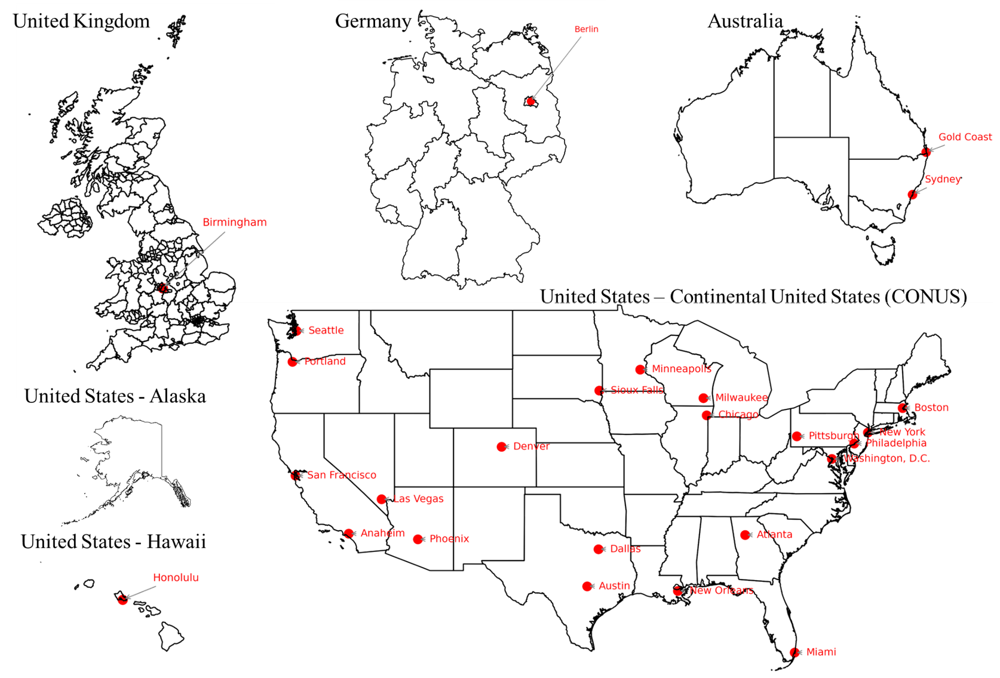
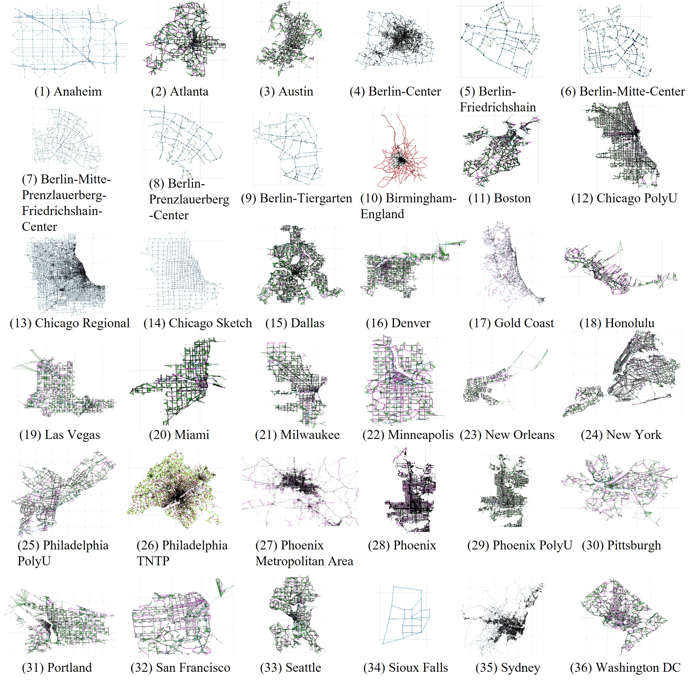

# GMNS Plus Dataset

The **GMNS Plus Dataset** is a publicly available, standardized transportation network collection based on the [General Modeling Network Specification (GMNS)](https://github.com/zephyr-data-specs/GMNS). This project aims to support reproducible and comparable research in transportation modeling, planning, and analysis.

Led by **NSF POSE Team from Arizona State University (ASU)**, the project is supported by the **National Science Foundation (NSF)** under the following initiative:

> **POSE: Phase II: CONNECT**  
> *[Consortium of Open-source plaNNing models for Next-generation Equitable and efficient Communities and Transportation](https://www.nsf.gov/awardsearch/showAward?AWD_ID=2303748&HistoricalAwards=false)*  
> **Award #: 2303748**

The dataset currently includes networks from a diverse set of cities and regions around the world:

```
01_Anaheim
02_Atlanta
03_Austin
04_Berlin-Center
05_Berlin-Friedrichshain
06_Berlin-Mitte-Center
07_Berlin-Mitte-Prenzlauerberg-Friedrichshain-Center
08_Berlin-Prenzlauerberg-Center
09_Berlin-Tiergarten
10_Birmingham-England
11_Boston
12_Chicago_Downtown
13_Chicago_Regional
14_Chicago_Sketch
15_Dallas
16_Denver
17_GoldCoast
18_Honolulu
19_Las_Vegas
20_Miami
21_Milwaukee
22_Minneapolis
23_New_Orleans
24_New_York
25_Philadelphia
26_Paradise
27_Phoenix_Metropolitan_Area
28_Phoenix_City
29_Phoenix_Walk
30_Pittsburgh
31_Portland
32_San_Francisco
33_Seattle
34_Sioux_Falls
35_Sydney
36_Washington_DC
```


These networks are formatted in GMNS to enable consistency, interoperability, and ease of use in academic and applied transportation research.


## Optimization Models
- The GMNS+ has a set of optimization models on [Colab notebook](https://colab.research.google.com/drive/1VugIavOnZWLd0tXGWDXmFLdkUTYgjDR1#scrollTo=aIiQvw22Yy_u). These problems cover: (1) Shortest Path Problem, (2) Facility Location Problem, (3) Traffic Assigment Problem, (4) OD Matrix Estimation (ODME).

## Updates
### 04/22/2025 Update Log

- Updated network list.

### 04/11/2025 Update Log

- Reorganized all networks into a consistent and sequential order for easier access and management.
- Added a new [Colab notebook](https://colab.research.google.com/drive/1VugIavOnZWLd0tXGWDXmFLdkUTYgjDR1#scrollTo=aIiQvw22Yy_u), which includes four optimization problems related to the network data. These problems cover: (1) Shortest Path Problem, (2) Facility Location Problem, (3) Traffic Assigment Problem, (4) OD Matrix Estimation (ODME).

### 04/07/2025 Update Log

- Added 18 new networks, including:
17_Atlanta, 18_Seattle, 19_Portland, 20_Denver, 21_Las_Vegas, 22_Chicago, 23_Honolulu, 24_New_Orleans, 25_Austin, 26_Minneapolis, 27_Dallas, 28_Milwaukee, 29_New_York, 30_Washington, 31_Boston, 32_Philadelphia, 33_Pittsburgh, and 34_Miami.
These additions further enrich the geographic diversity of the dataset and support more comprehensive transportation research across various urban settings.

### 04/02/2025 Update Log

- Added `16_San_Francisco` network, sourced from [*A unified dataset for the city-scale traffic assignment model in 20 U.S. cities*](https://www.nature.com/articles/s41597-024-03149-8).
- For detailed update notes, please refer to the shared document:  
  [Update Notes - San Francisco Network](https://docs.google.com/document/d/16bntW9nyxsbYZMI8PWNK5vrUVDBryEpe7b39NsaAWYw/edit?tab=t.0)

## Network Generation from OpenStreetMap Tools

Many of the networks in this dataset—such as **13_Phoenix**—are generated using a set of open-source tools, including [OSM2GMNS](https://osm2gmns.readthedocs.io/en/latest/index.html). These tools convert OpenStreetMap (OSM) data into GMNS-compliant formats, allowing for automated, transparent, and scalable network generation.

All generated networks undergo detailed verification to ensure structural integrity and suitability for simulation and modeling tasks.

Looking ahead, the project aims to scale this effort to cover:
- **All 50 U.S. states and the District of Columbia**
- **Major international metropolitan areas**, including **Tokyo**

This expansion will further support GMNS+ transportation research with standardized, high-quality network data.

## TNTP-to-GMNS Conversion and Standardization

Another key component of this project is the conversion and standardization of legacy TNTP-format networks into the GMNS format. This work ensures that valuable historical datasets can be integrated into modern modeling pipelines and benefit from the standardized structure provided by GMNS.

We gratefully acknowledge the original TNTP dataset hosted at:  
🔗 https://github.com/bstabler/TransportationNetworks
Released by Ben Stabler.

> *Transportation Networks* is a repository dedicated to supporting transportation research by providing openly available network data.  
>  
> *“If you are developing algorithms in this field, you probably asked yourself more than once: where can I get good data? The purpose of this site is to provide an answer for this question!”*  
>  
> Many of these networks are used for studying the **Traffic Assignment Problem**, a fundamental challenge in transportation science.  
> A theoretical foundation for this topic can be found in:  
> 📘 *“The Traffic Assignment Problem – Models and Methods” by Michael Patriksson, VSP 1994.*

This repository represents an updated version of Dr. Hillel Bar-Gera’s original TNTP website. As of **May 1, 2016**, all data updates are maintained on this GitHub repository only.

We thank the TNTP team for making these important datasets available to the research community.

## Differences Between Original TNTP and GMNS Format

While the original TNTP datasets are comprehensive and widely used, their formats differ slightly from the GMNS specification. As part of this project, we have developed a standardized conversion process to align TNTP networks with GMNS requirements.

This process includes:
- **Schema unification**: Adjusting field names, data structures, and file formats to conform to GMNS standards.
- **Validation and documentation**: Logs and memos detailing the integration and modification steps are available in the `Documents` directory.
- **Handling incomplete networks**: Some TNTP datasets are missing node information or other structural components. These networks are currently stored in the `Incomplete_Networks` folder and will be completed and released in future updates.

This alignment enables consistent data handling, easier model integration, and improved reproducibility across research projects.

## Multi-Level Modeling Readiness and Validation Framework

To guarantee both structural integrity and modeling usability, the GMNS+ Dataset project introduces a standardized multi-level modeling readiness and validation framework. This framework ensures that each dataset is not only complete and internally consistent but also fully prepared for simulation, performance analysis, and data-driven applications. From basic file checks to ODME preparation and traffic assignment validation, each level addresses a key aspect of model-readiness, offering a systematic path from raw data to reliable outputs.
### 🔍 Level 1: Basic Data File Validation
- **File Existence**: Confirms that `node.csv` and `link.csv` files exist and are readable.
- **Required Fields & Data Types**: Verifies essential fields (e.g., `node_id`, `link_id`) and their data types (e.g., integers for IDs, floats for coordinates or speeds).
- **Sorted Data Structure**: Ensures nodes are sorted by `node_id`, and links by `from_node_id` and `to_node_id`.
- **Link Endpoints**: Checks that all link endpoints are valid and exist in the node file.

### 🌐 Level 2: Demand and Zone Consistency
- **Zone Centroids**: Validates that each zone has a matching centroid node (`node_id == zone_id`), grouped at the top of the node list.
- **Connector Links**: Identifies and checks connector links from centroids to the main network.
- **Demand File Structure**: Confirms that the demand file has exactly three columns (`o_zone_id`, `d_zone_id`, `volume`) in the correct order.
- **Zone Consistency Across Files**: Ensures that all zones referenced in the demand file exist in the node file.

### 📏 Level 3: Network Attributes Validation
- **Speed and Length Units**: Verifies that speeds are in consistent units (e.g., km/h, mph) and link lengths are properly measured (e.g., meters vs. miles).
- **Capacity Values**: Checks that capacities are within reasonable bounds and consistent with expected per-lane capacities.
- **Unit Conversions**: Validates field consistency based on standard conversion factors (e.g., meters to miles).
- **VDF Parameters**: Confirms that Volume Delay Function (VDF) fields (e.g., `vdf_alpha`, `vdf_beta`) are present, non-negative, and reasonable.

### 🚗 Level 4: Single Mode Configuration Validation
- **Configuration Files**: Confirms presence and formatting of files like `mode_type.csv` and `settings.csv`.
- **Single Mode Requirement**: Checks that only one mode is defined, with warnings if multiple modes are found in single-mode setups.
- **Parameter Consistency**: Ensures simulation parameters (e.g., number of iterations, demand period length) are within reasonable and expected limits.

### 📊 Level 5: Observed Volume Checks and ODME Preparation
- **Observed Volumes**: Validates `obs_volume` fields in the link file (e.g., no negatives, sufficient coverage).
- **ODME Requirements**: Prepares the network for Origin-Destination Matrix Estimation (ODME) by confirming that enough quality observed volume data exists.

### 🛰️ Level 6: Accessibility Assessment
- **OD Connectivity**: Checks `od_performance.csv` to ensure OD pairs with demand have feasible paths.
- **Route Assignments (optional)**: Validates additional route assignment data, if available.
- **Accessibility Metrics**: Computes accessibility indicators (e.g., number of destinations per origin) and flags cases with insufficient connectivity.

### 🛣️ Level 7: Traffic Assignment Validation
- **Link and Route Performance**: Analyzes outputs like total assigned volume, VMT, VHT, and average speeds.
- **Statistical Comparisons**: Compares assigned volumes against reference/observed volumes using metrics like R², RMSE, and MAPE.
- **Route Consistency**: Ensures that route probability distributions are valid (e.g., sum to 1 per OD pair) and congestion levels are realistic.

### 🧪 Level 8: Extended ODME Post-Quality Checks
- **Target Demand Matching**: Checks whether ODME-adjusted demands match target values.
- **Feasible High-Demand Paths**: Verifies that high-demand OD pairs are assigned feasible routes with acceptable travel times.
- **Outlier Identification**: Flags route and volume anomalies to maintain network quality.

## GMNS Tools and Visualization Support

In addition to the datasets and validation framework, this repository also provides a set of **common tools and utilities for working with GMNS networks**, including:

- 🛠 **Scripts in `GMNS_Tools/`**: These include frequently used data preprocessing and conversion utilities to support tasks such as format transformation, attribute completion, and batch validation.

- 📊 **Visualization via [NEXTA](https://github.com/asu-trans-ai-lab/NeXTA4GMNS)**: A lightweight network visualization and analysis platform built to support GMNS-compatible networks, allowing users to explore topology, traffic volume, and accessibility results.

- 🚦 **Network Accessibility Checks with [DTALite](https://github.com/itsfangtang/DTALite_release)**: The DTALite simulator is used to evaluate network connectivity and perform accessibility analysis across origin-destination (OD) pairs.

These tools work together to streamline the process of data verification, simulation readiness, and visual inspection of network structures.


## How to Use the Multi-Level Modeling Readiness and Validation Tool

You can run the **multi-level data validation process** using the script `Network_Validator_Main.py`.

### ▶️ To validate all networks in the current directory:

```bash
python Network_Validator_Main.py
```

This will:
- Automatically detect all subdirectories containing network data,
- Perform validation across all defined levels (1–8),
- And generate a **detailed validation report** for each network.

---

### 🎯 To validate a specific network only:

Open the script and modify the following line:

```python
subdirectories = get_all_directories('.')
```

Change `'.'` to the name of the folder you want to validate.  
For example, to validate only the **Sydney** network:

```python
subdirectories = get_all_directories('16_Sydney')
```

This allows you to selectively check a single network without scanning the entire directory.

---

The validation results will be saved in output files that summarize which levels passed, failed, or triggered warnings, making it easier to identify and fix data issues.